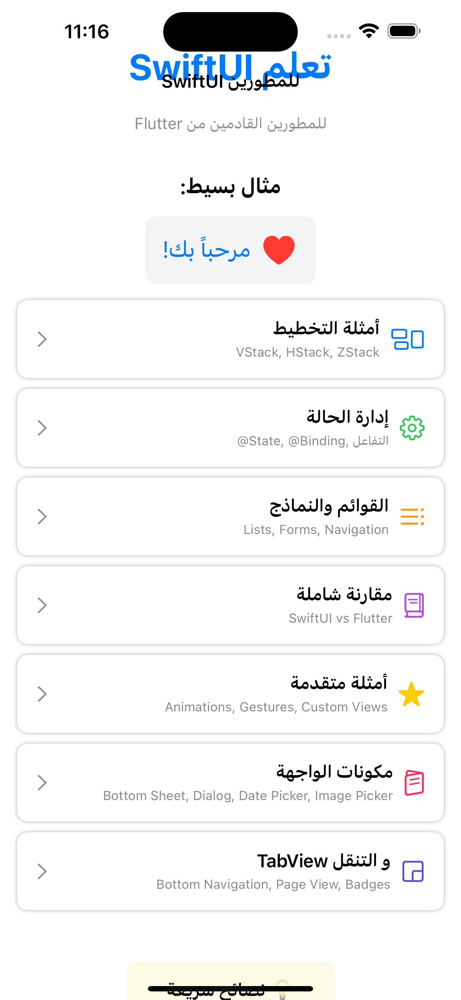
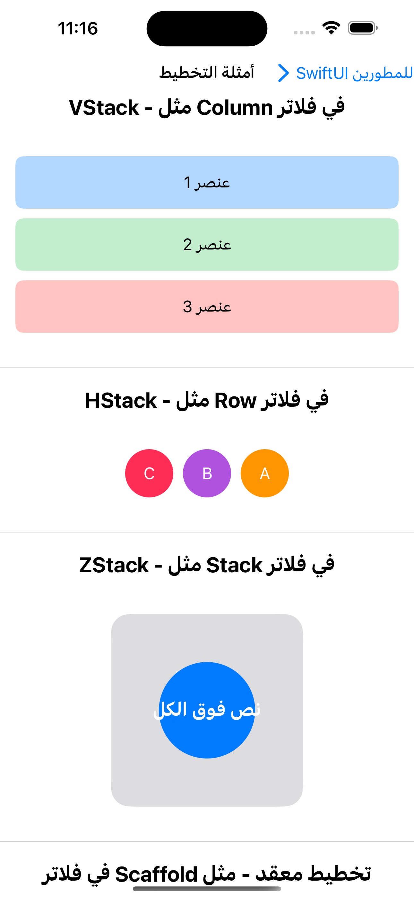
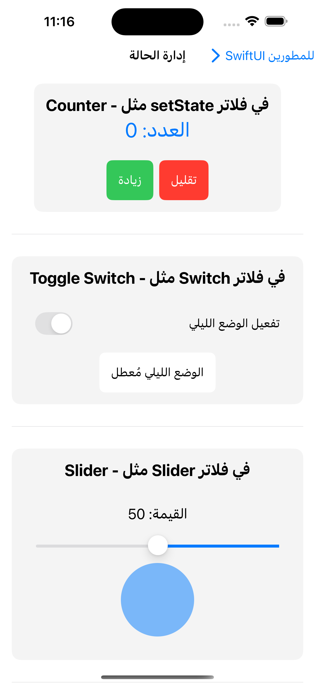
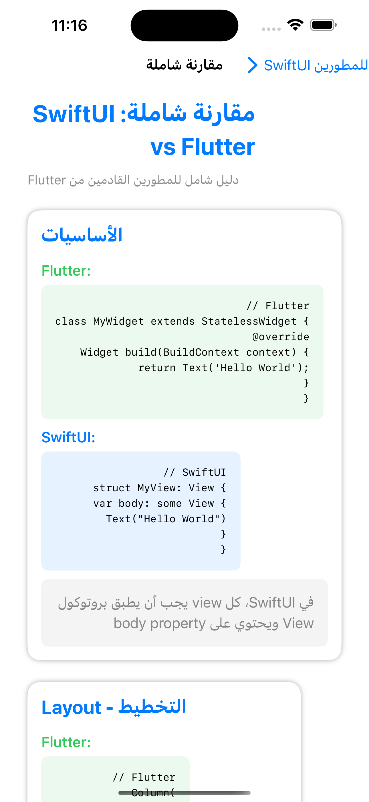
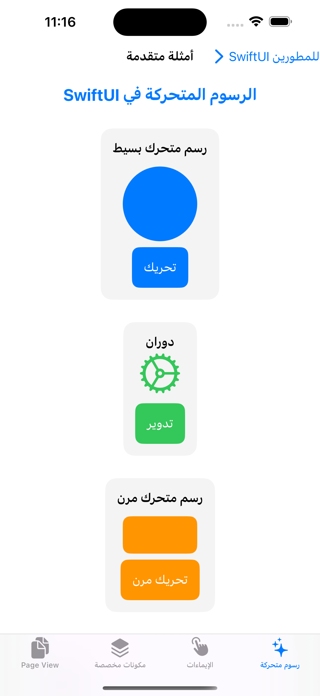
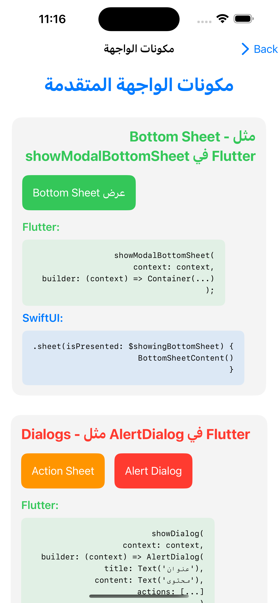
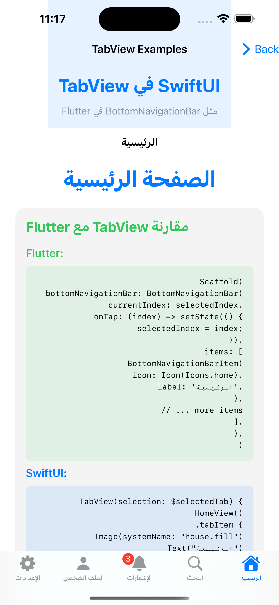
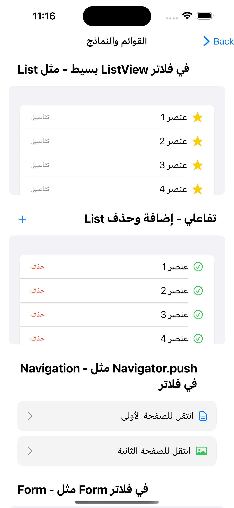

# 🚀 Flutter to SwiftUI Guide

<div align="center">


**Interactive iOS app teaching SwiftUI to Flutter developers in Arabic**

[Features](#-features) • [Installation](#-installation) • [Content](#-app-content) • [Screenshots](#-screenshots) • [Contributing](#-contributing)

</div>

## 📖 About

A comprehensive **Arabic-language** iOS educational app specifically designed for **Flutter developers** transitioning to **SwiftUI**. This interactive learning companion provides hands-on examples, detailed comparisons, and practical tutorials to master iOS development with SwiftUI.

### 🎯 Goals
- **Bridge the gap** between Flutter and SwiftUI development
- **Accelerate learning** through direct code comparisons
- **Provide Arabic-first iOS development resources**
- **Offer practical, real-world applicable examples**

## 🌟 Features

### 📚 Comprehensive Learning Modules
- **7 different educational sections** covering all SwiftUI aspects
- **Side-by-side code comparisons** between Flutter and SwiftUI
- **50+ interactive examples** with live demonstrations
- **Progressive complexity** from beginner to advanced concepts

### 🎨 Arabic-First Design
- **Full RTL (Right-to-Left) support** throughout the app
- **Culturally appropriate design patterns** for Arabic users
- **Consistent typography and colors** optimized for Arabic text
- **Accurate technical term translations** in Arabic

### ⚡ Interactive Experience
- **Live, editable examples** you can modify and explore
- **Educational animations** demonstrating concepts
- **Real-time preview** of code changes
- **Gesture recognition examples** with touch interactions

## 🛠 Installation & Setup

### Requirements
- **macOS** 15.5+ (Sequoia)
- **Xcode** 16.4+
- **iOS Simulator** or physical device with iOS 18.5+
- **Swift** 5.9+

### Quick Start

1. **Clone the repository**
```bash
git clone https://github.com/mahdi-code007/Flutter-to-SwiftUI-Guide.git
cd Flutter-to-SwiftUI-Guide
```

2. **Open in Xcode**
```bash
open "Flutter to SwiftUI Guide.xcodeproj"
```

3. **Build and Run**
   - Select your target device (iOS Simulator or connected device)
   - Press `⌘ + R` or click the Run button

## 📱 App Content

### 1. 🏗 Layout Examples
**Learn SwiftUI layout system compared to Flutter widgets**

```swift
// SwiftUI VStack equivalent to Flutter Column
VStack(spacing: 10) {
    Text("Item 1")
    Text("Item 2")
    HStack {
        Text("A")
        Text("B")
    }
}
```

**What you'll learn:**
- **VStack vs Column**: Vertical layout arrangements
- **HStack vs Row**: Horizontal layout arrangements  
- **ZStack vs Stack**: Overlapping layout system
- **Complex layouts**: Combining multiple layout types
- **Spacing and alignment**: Fine-tuning layout appearance

### 2. ⚙️ State Management
**Master SwiftUI's reactive state system**

```swift
struct Counter: View {
    @State private var count = 0
    
    var body: some View {
        VStack {
            Text("Count: \(count)")
            Button("Increment") {
                count += 1
            }
        }
    }
}
```

**Key concepts covered:**
- **@State vs setState**: Local state management
- **@Binding**: Data binding between views
- **Toggle, Slider, TextField**: Interactive UI elements
- **Real-world examples**: Practical state management patterns

### 3. 📋 Lists & Forms
**Build dynamic lists and forms like Flutter's ListView**

```swift
List(items, id: \.self) { item in
    HStack {
        Image(systemName: "star.fill")
        Text(item)
        Spacer()
    }
}
```

**Features demonstrated:**
- **List vs ListView**: Displaying collections of data
- **ForEach**: Dynamic content generation
- **Navigation**: Moving between screens
- **Add/Delete**: Modifying lists interactively
- **Search and filtering**: Advanced list operations

### 4. 🔗 Comprehensive Comparison Guide
**Side-by-side Flutter vs SwiftUI code examples**

| Flutter | SwiftUI |
|---------|---------|
| `StatefulWidget` | `@State` |
| `Column` | `VStack` |
| `Row` | `HStack` |
| `Stack` | `ZStack` |
| `ListView` | `List` |
| `showModalBottomSheet` | `.sheet` |

### 5. 🎨 Advanced Examples
**Complex UI patterns and animations**

- **Custom animations**: Spring, rotation, scale effects
- **Gesture recognition**: Tap, drag, long press, and pinch
- **Custom components**: Reusable UI elements
- **Page navigation**: Tab views and page-style navigation

### 6. 🧩 UI Components
**Essential iOS UI elements**

```swift
// Bottom Sheet example
.sheet(isPresented: $showingSheet) {
    BottomSheetContent()
}
```

**Components covered:**
- **Bottom Sheets**: Modal presentations
- **Alerts & Action Sheets**: User confirmations
- **Date Pickers**: Date and time selection
- **Image Pickers**: Photo selection from library
- **Custom modifiers**: Reusable styling

### 7. 📑 TabView & Navigation
**Master iOS navigation patterns**

```swift
TabView {
    HomeView()
        .tabItem {
            Image(systemName: "house")
            Text("Home")
        }
    
    SettingsView()
        .tabItem {
            Image(systemName: "gear")
            Text("Settings")
        }
}
```

**Navigation concepts:**
- **TabView vs BottomNavigationBar**: Tab-based navigation
- **Page-style navigation**: Swipe-able pages
- **Badge support**: Notification indicators
- **Programmatic navigation**: Controlling tabs from code

## 📸 Screenshots

<div align="center">

### Core Features & Learning Modules

| Main Menu | Layout Examples | State Management | Comparison Guide |
|-----------|----------------|------------------|------------------|
|  |  |  |  |
| *Interactive menu with Arabic RTL support* | *VStack, HStack, ZStack demonstrations* | *Counter, Toggle, Slider examples* | *Side-by-side Flutter vs SwiftUI code* |

### Advanced Features & UI Components

| Advanced Examples | UI Components | TabView Navigation | Lists & Forms |
|-------------------|---------------|-------------------|---------------|
|  |  |  |  |
| *Animations and gesture recognition* | *Bottom sheets, alerts, date pickers* | *Tab-based navigation with badges* | *Interactive lists and forms* |

> 🌟 **Note**: All screenshots showcase the app's full Arabic RTL (Right-to-Left) support with native iOS design patterns.

</div>

## 🏗 Architecture

### Project Structure
```
Flutter to SwiftUI Guide/
├── demo/
│   ├── ContentView.swift          # Main navigation hub
│   ├── LayoutExamplesView.swift   # VStack, HStack, ZStack demos
│   ├── StateManagementExamplesView.swift # @State, @Binding examples
│   ├── ListExamplesView.swift     # List and ForEach patterns
│   ├── ComparisonGuideView.swift  # Flutter vs SwiftUI comparisons
│   ├── AdvancedExamplesView.swift # Animations and gestures
│   ├── UIComponentsExamplesView.swift # Sheets, alerts, pickers
│   ├── TabViewExamplesView.swift  # Navigation patterns
│   └── Assets.xcassets/           # App icons and colors
├── demoTests/                     # Unit tests
└── demoUITests/                   # UI automation tests
```

### Code Quality
- **SwiftUI best practices**: Following Apple's guidelines
- **Clean architecture**: Modular, reusable components
- **Comprehensive documentation**: Well-commented code
- **Accessibility support**: VoiceOver and Dynamic Type
- **Error handling**: Robust edge case management

## 🚀 Getting Started for Developers

### Understanding the Codebase

1. **Start with `ContentView.swift`** - The main navigation hub
2. **Explore `LayoutExamplesView.swift`** - Basic SwiftUI layouts
3. **Study `StateManagementExamplesView.swift`** - Reactive programming
4. **Review `ComparisonGuideView.swift`** - Flutter vs SwiftUI patterns

### Key Learning Points

```swift
// Flutter to SwiftUI Mental Model
Flutter Widget ≈ SwiftUI View
StatefulWidget ≈ @State property
setState() ≈ @State property change
Column ≈ VStack
Row ≈ HStack
Stack ≈ ZStack
```

## 🤝 Contributing

We welcome contributions! Here's how you can help:

### Ways to Contribute
- **Add new examples**: More Flutter-to-SwiftUI comparisons
- **Improve Arabic translations**: Better technical term translations
- **Bug fixes**: Report and fix issues
- **Documentation**: Improve code comments and guides
- **UI/UX improvements**: Better visual design

### Contribution Process
1. Fork the repository
2. Create a feature branch (`git checkout -b feature/new-example`)
3. Commit your changes (`git commit -am 'Add new SwiftUI example'`)
4. Push to the branch (`git push origin feature/new-example`)
5. Create a Pull Request

### Code Standards
- Follow SwiftUI best practices
- Add Arabic comments for new features
- Include both Flutter and SwiftUI examples for comparisons
- Test on both iOS Simulator and physical devices

## 📄 License

This project is licensed under the MIT License - see the [LICENSE](LICENSE) file for details.

## 👨‍💻 Author

**Mahdi Abd El-Mageed**
- GitHub: [@mahdi-code007](https://github.com/mahdi-code007)
- Project: [Flutter to SwiftUI Guide](https://github.com/mahdi-code007/Flutter-to-SwiftUI-Guide)

## 🙏 Acknowledgments

- **Apple Developer Documentation** - SwiftUI guidelines and best practices
- **Flutter Community** - Inspiration for comparative learning approaches
- **Arabic Developer Community** - Feedback and suggestions for Arabic localization

## 📈 Roadmap

### Upcoming Features
- [ ] **More advanced animations** (Custom transitions, complex gestures)
- [ ] **Core Data integration** (Data persistence examples)
- [ ] **Networking examples** (API calls, JSON parsing)
- [ ] **Testing tutorials** (Unit tests, UI tests for SwiftUI)
- [ ] **Accessibility deep dive** (VoiceOver, Dynamic Type)
- [ ] **Performance optimization** (LazyVStack, efficient rendering)

### Future Enhancements
- [ ] **iPad-optimized layouts**
- [ ] **macOS catalyst support**
- [ ] **SwiftUI for watchOS examples**
- [ ] **Integration with UIKit** (UIViewRepresentable)

---

<div align="center">

**Found this helpful? Give it a ⭐️ and share with fellow developers!**

[Report Bug](https://github.com/mahdi-code007/Flutter-to-SwiftUI-Guide/issues) • [Request Feature](https://github.com/mahdi-code007/Flutter-to-SwiftUI-Guide/issues) • [Follow Updates](https://github.com/mahdi-code007/Flutter-to-SwiftUI-Guide/watchers)

</div> 